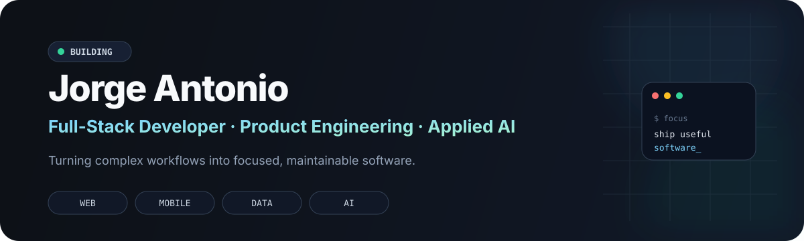

  

<h1 align="center">Jorge Antonio 👋</h1>

  <strong>Full-Stack Developer · Product Engineering · Applied AI</strong>

  Building useful software for web, mobile, internal systems, and AI-assisted workflows.

  <a href="mailto:soporte.georgecoding@gmail.com">Email</a>
  ·
  <a href="https://github.com/JorgeAntonio?tab=repositories">Repositories</a>

---

## Featured projects

| Project | What it does |
| --- | --- |
| [**Flutter Icon Generator**](https://github.com/JorgeAntonio/flutter-icon-generator) | Multi-platform icon generator for Flutter apps. |
| [**Flat Side Drawer**](https://github.com/JorgeAntonio/flat_side_drawer) | Flutter package for clean, gesture-driven side navigation. |
| [**Face Login Local**](https://github.com/JorgeAntonio/face-login) | Local authentication prototype with facial verification. |
| [**Backend Sessions**](https://github.com/JorgeAntonio/backend-development-django) | Backend learning hub focused on Python, Django, DRF, and deployment. |

## Stack

  <strong>Web:</strong> TypeScript · Next.js · React · Node.js · Supabase · PostgreSQL 
  <strong>Mobile & desktop:</strong> Flutter · Dart · Python 
  <strong>UI & workflow:</strong> Tailwind CSS · shadcn/ui · GitHub Actions · Linux · pnpm · AI-assisted development

